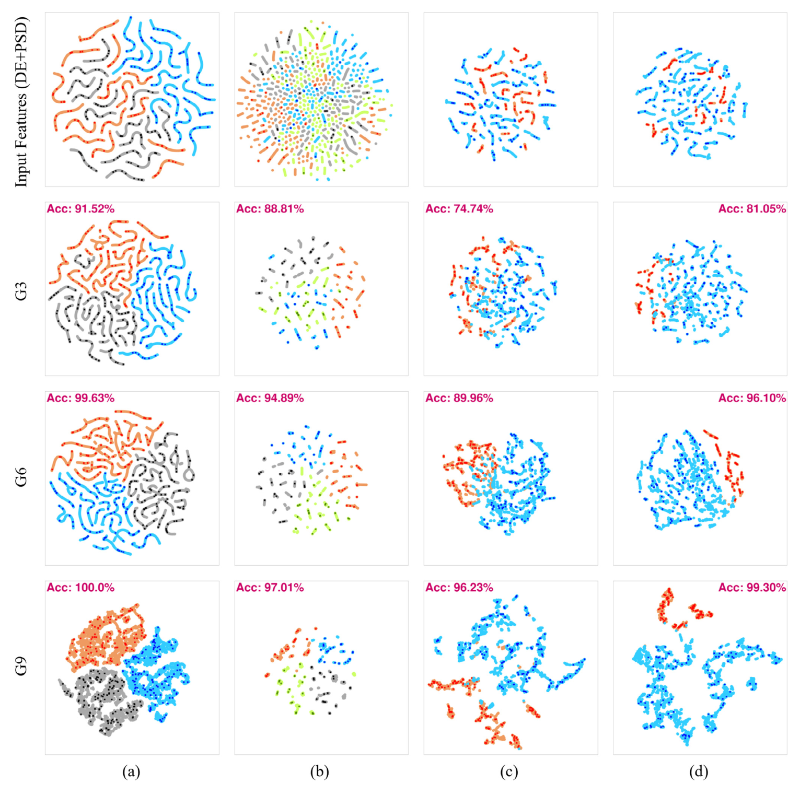

# SGCL: Semi-supervised Graph Contrastive Learning for EEG Emotion Recognition

## Status

| Item | Status |
|---|---|
| Research | Published · EAAI 2025 |
| Implementation | Training, evaluation, and ablation configurations |

Dae Hyeon Kim and Young-Seok Choi  
*Engineering Applications of Artificial Intelligence* 161, 111969, 2025. [Paper](https://doi.org/10.1016/j.engappai.2025.111969)

SGCL combines DE and PSD feature networks through symmetric similarity network fusion (SSNF), then trains a shared graph encoder with supervised and graph contrastive objectives.

## Architecture


*Nodes represent EEG sample windows; edges represent sample similarity.*

| Component | Operation |
|---|---|
| Node features | Differential entropy (DE) and power spectral density (PSD) |
| Graph construction | Feature-specific similarity networks, broad/local k-nearest neighborhoods, symmetric normalization, and cross-diffusion |
| Encoder | Shared two-layer GCN with CELU activation and a projection head |
| Augmentation | Edge dropping and feature masking |
| Objective | Cross-entropy on labeled nodes + weighted contrastive loss on the two graph views |

## Results

**Protocol:** subject-wise, transductive node classification. Labeled and unlabeled samples participate in the graph; supervision uses the labeled subset. These results do not measure transfer to an unseen subject. Accuracy is reported as mean ± standard deviation (%), following Tables 1, 2, and 5.

| Dataset / task | Case 1 | Case 2 | Case 3 |
|---|---:|---:|---:|
| SEED | 99.54 ± 0.47 | 99.98 ± 0.05 | 99.99 ± 0.01 |
| SEED-IV | 84.61 ± 4.20 | 90.30 ± 4.32 | 95.38 ± 1.75 |
| DEAP valence | 91.04 ± 2.68 | 94.52 ± 2.11 | 96.88 ± 1.60 |
| DEAP arousal | 91.01 ± 3.71 | 95.12 ± 2.12 | 97.15 ± 1.61 |

| Dataset | Labeled samples per class, Cases 1 / 2 / 3 | Labeled fraction, Cases 1 / 2 / 3 |
|---|---|---|
| SEED | 60 / 90 / 120 | 1.8% / 2.7% / 3.5% |
| SEED-IV | 15 / 20 / 25 | 2.4% / 3.2% / 4.0% |
| DEAP | 60 / 90 / 120 | 4.8% / 7.1% / 9.5% |

### Component ablation

Case 1, accuracy (%); selected rows from Tables 7–8. All three settings use DE + PSD + SSNF.

| Setting | SEED | SEED-IV | DEAP valence | DEAP arousal |
|---|---:|---:|---:|---:|
| PCA + GCN (G3) | 93.58 ± 3.57 | 77.43 ± 6.35 | 83.95 ± 4.10 | 82.50 ± 4.48 |
| Graph encoder (G6) | 98.18 ± 1.15 | 80.62 ± 4.51 | 88.08 ± 3.17 | 88.22 ± 3.38 |
| SGCL (G9) | 99.54 ± 0.47 | 84.61 ± 4.20 | 91.04 ± 2.68 | 91.01 ± 3.71 |

<details>
<summary>Embedding analysis</summary>



*Representative-subject t-SNE plots; annotations belong to these examples, not the aggregate results above.*

</details>

## Getting Started

### Installation

```bash
git clone https://github.com/dhkim-kr/sgcl.git
cd sgcl
pip install -r requirements.txt
```

Tested with Python 3.9+ and PyTorch 2.1+ (original runs: Python 3.9, PyTorch 2.1.0, CUDA 11.8).

### Data preparation

- **SEED / SEED-IV** (https://bcmi.sjtu.edu.cn/home/seed/): use the official precomputed `ExtractedFeatures` (SEED) and `eeg_feature_smooth` (SEED-IV) DE/PSD-LDS features directly.
- **DEAP** (https://www.eecs.qmul.ac.uk/mmv/datasets/deap/): ratings come from `data_preprocessed_matlab/sXX.mat`. DE/PSD features are extracted externally in the SEED format — per subject `(32 ch, 40 trials, 63 windows, 4 bands)`, 1-s Hann windows at 128 Hz over theta/alpha/beta/gamma, LDS-smoothed.

Point the `data:` section of each config at your local copies. The first run caches per-subject arrays under `cache_dir`; later runs skip the raw `.mat` parsing.

### Usage

```bash
# main results, all three labeling cases
python main.py --config configs/seed.yaml
python main.py --config configs/seed_iv.yaml
python main.py --config configs/deap_valence.yaml
python main.py --config configs/deap_arousal.yaml

# subset run: one case, three subjects, verbose logging
python main.py --config configs/seed_iv.yaml --cases 3 --subjects 1 2 3 --verbose
```

Each run writes per-subject accuracy, F1, and confusion matrices plus a mean±std summary under `experiment.output_dir`. All hyperparameters live in the YAML configs; CLI flags override them.

---

## Reproducing the Paper

| Paper artifact | Command |
|---|---|
| Tables 2, 4, 5 — main results | the four commands above |
| Additional cross-session configuration | `python main.py --config configs/seed_iv_cross_session.yaml` |
| Table 6 — training time | add `--timed` |
| Tables 7-8 — method ablation G1-G9 | `--mode ablation` (subset via `--schemes de_gcl psd_gcl ...`) |
| Table 9 — window size | `python main.py --config configs/seed_iv_1s.yaml` |
| Table 10 — KNN necessity | `--graph-variant no_knn` / `no_broad_knn` / `no_local_knn` |
| Fig. 4 — t-SNE scatters | run with `--save-embeddings`, then `--mode tsne` |
| Fig. 5 — saliency topomaps | `--mode saliency` (needs `mne`) |
| Fig. 6 — p_e × p_f grid | `--mode grid --cases 3` |

The release refactors the research notebooks into modules. The `no_broad_knn` and `no_local_knn` variants reconstruct ablation configurations. Paper Table 3 compares SGCL with methods evaluated under different labeling and session protocols; it is not a matched cross-session evaluation of SGCL.

---

## Citation

```bibtex
@article{kim2025sgcl,
  title   = {Semi-supervised graph contrastive learning for emotion recognition
             based on electroencephalogram signals},
  author  = {Kim, Dae Hyeon and Choi, Young-Seok},
  journal = {Engineering Applications of Artificial Intelligence},
  volume  = {161},
  pages   = {111969},
  year    = {2025},
  doi     = {10.1016/j.engappai.2025.111969}
}
```

## Acknowledgements

The contrastive-loss implementation is adapted from [GRACE](https://github.com/CRIPAC-DIG/GRACE) (Zhu et al., 2020).

## License

This project is released under the [MIT License](LICENSE).
