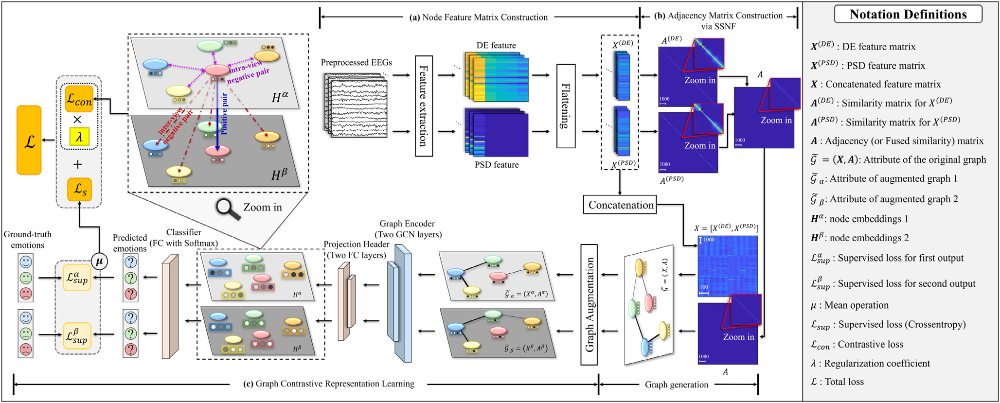

# [EAAI 2025] Semi-supervised Graph Contrastive Learning for Emotion Recognition based on Electroencephalogram Signals

<div align="center">

**Dae Hyeon Kim**<sup></sup>, **Young-Seok Choi**<sup>*</sup>

<sup></sup>Department of Electronics and Communications Engineering, Kwangwoon University, Seoul, South Korea

[](https://www.sciencedirect.com/journal/engineering-applications-of-artificial-intelligence)
[](https://doi.org/10.1016/j.engappai.2025.111969)
[](LICENSE)

</div>

---

## 📢 News

* **[Aug. 2026]** 🚀 **The official code released!**
* **[Sep. 2025]** 📖 Our paper has been published in ***Engineering Applications of Artificial Intelligence***, vol. 161 (available online September 1, 2025).
* **[Aug. 2025]** 🎉 Our paper **"Semi-supervised graph contrastive learning for emotion recognition based on electroencephalogram signals"** has been accepted to ***Engineering Applications of Artificial Intelligence***! (August 4, 2025)
* **[Jun. 2025]** ✍️ Revised manuscript submitted. (June 20, 2025)
* **[Nov. 2024]** 📨 Manuscript submitted. (November 28, 2024)

---

## 📄 Publication

> D. H. Kim and Y.-S. Choi, "Semi-supervised graph contrastive learning for emotion recognition based on electroencephalogram signals," *Engineering Applications of Artificial Intelligence*, vol. 161, p. 111969, 2025. https://doi.org/10.1016/j.engappai.2025.111969

*Engineering Applications of Artificial Intelligence* — **Elsevier** · **Impact Factor 9.0** · **JCR Q1**

---

## 📝 Abstract

Labeling EEG is expensive, but unlabeled EEG is abundant. **SGCL** trains an emotion classifier from a handful of labeled samples per class by leveraging every unlabeled sample in a transductive graph — reaching 99.99% average accuracy on SEED with only 3.5% of the data labeled.

The framework consists of three components:

- **SSNF (Symmetric Similarity Network Fusion)** — DE and PSD features each build an exponential-kernel similarity network; a dual k-NN scheme (broad k1, local k2) with symmetric normalization and cross-diffusion fuses them into one adjacency matrix.
- **GE (Graph Encoder)** — a shared two-layer GCN encoder (CELU) with a two-layer projection head.
- **GCL (Graph Contrastive Learning)** — two graph views from uniform edge dropping and feature masking, pulled together by an InfoNCE loss alongside cross-entropy on the labeled nodes: `L = L_sup + λ·L_con`.

<div align="center">
  
  <br>
  <em>Figure 1: The entire framework of the proposed SGCL model.</em>
</div>

---

## 📊 Results

Average accuracy (%) over subjects, by labeled samples per class (Case 1/2/3):

| Dataset | Case 1 | Case 2 | Case 3 |
|---|---|---|---|
| SEED (3-class) | 99.54 | 99.98 | 99.99 |
| SEED-IV (4-class) | 84.61 | 90.30 | 95.38 |
| DEAP valence | 91.04 | 94.52 | 96.88 |
| DEAP arousal | 91.01 | 95.12 | 97.15 |

---

## 🚀 Getting Started

### Installation

```bash
git clone https://github.com/dhkim-kr/sgcl.git
cd sgcl
pip install -r requirements.txt
```

Tested with Python 3.9+ and PyTorch 2.1+ (original runs: Python 3.9, PyTorch 2.1.0, CUDA 11.8).

### Data preparation

- **SEED / SEED-IV** (https://bcmi.sjtu.edu.cn/home/seed/): use the official precomputed `ExtractedFeatures` (SEED) and `eeg_feature_smooth` (SEED-IV) DE/PSD-LDS features directly.
- **DEAP** (https://www.eecs.qmul.ac.uk/mmv/datasets/deap/): ratings come from `data_preprocessed_matlab/sXX.mat`. DE/PSD features are extracted externally in the SEED format — per subject `(32 ch, 40 trials, 63 windows, 4 bands)`, 1-s Hann windows at 128 Hz over theta/alpha/beta/gamma, LDS-smoothed.

Point the `data:` section of each config at your local copies. The first run caches per-subject arrays under `cache_dir`; later runs skip the raw `.mat` parsing.

### Usage

```bash
# main results, all three labeling cases
python main.py --config configs/seed.yaml
python main.py --config configs/seed_iv.yaml
python main.py --config configs/deap_valence.yaml
python main.py --config configs/deap_arousal.yaml

# a quick look: one case, a few subjects, live logs
python main.py --config configs/seed_iv.yaml --cases 3 --subjects 1 2 3 --verbose
```

Each run writes per-subject accuracy, F1, and confusion matrices plus a mean±std summary under `experiment.output_dir`. All hyperparameters live in the YAML configs; CLI flags override them.

---

## 🔬 Reproducing the Paper

| Paper artifact | Command |
|---|---|
| Tables 2, 4, 5 — main results | the four commands above |
| Table 3 — cross-session | `python main.py --config configs/seed_iv_cross_session.yaml` |
| Table 6 — training time | add `--timed` |
| Tables 7-8 — method ablation G1-G9 | `--mode ablation` (subset via `--schemes de_gcl psd_gcl ...`) |
| Table 9 — window size | `python main.py --config configs/seed_iv_1s.yaml` |
| Table 10 — KNN necessity | `--graph-variant no_knn` / `no_broad_knn` / `no_local_knn` |
| Fig. 4 — t-SNE scatters | run with `--save-embeddings`, then `--mode tsne` |
| Fig. 5 — saliency topomaps | `--mode saliency` (needs `mne`) |
| Fig. 6 — p_e × p_f grid | `--mode grid --cases 3` |

Notes: this is a refactoring of the research notebooks into modules, behavior-matched to the code that produced the paper (the training loop is trajectory-identical under the same weights and RNG). Graph construction was vectorized, seeding happens once per subject run, and F1 is taken at the best-accuracy epoch. The Table-10 `no_broad_knn` / `no_local_knn` variants are reconstructions; only `no_knn` survives verbatim in the original notebooks.

---

## 📚 Citation

```bibtex
@article{kim2025sgcl,
  title   = {Semi-supervised graph contrastive learning for emotion recognition
             based on electroencephalogram signals},
  author  = {Kim, Dae Hyeon and Choi, Young-Seok},
  journal = {Engineering Applications of Artificial Intelligence},
  volume  = {161},
  pages   = {111969},
  year    = {2025},
  doi     = {10.1016/j.engappai.2025.111969}
}
```

## 🙏 Acknowledgements

The contrastive-loss implementation is adapted from [GRACE](https://github.com/CRIPAC-DIG/GRACE) (Zhu et al., 2020).

## 📜 License

This project is released under the [MIT License](LICENSE).
